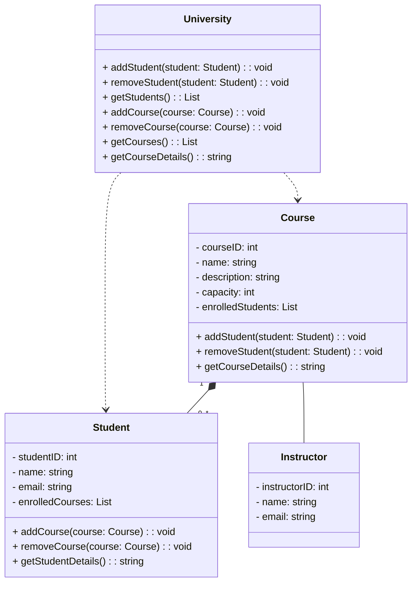

```mermaid
classDiagram
    class University {
        + addStudent(student: Student): void
        + removeStudent(student: Student): void
        + getStudents(): List<Student>
        + addCourse(course: Course): void
        + removeCourse(course: Course): void
        + getCourses(): List<Course>
        + getCourseDetails(): string
    }

    class Student {
        - studentID: int
        - name: string
        - email: string
        - enrolledCourses: List<Course>
        + addCourse(course: Course): void
        + removeCourse(course: Course): void
        + getStudentDetails(): string
    }

    class Course {
        - courseID: int
        - name: string
        - description: string
        - capacity: int
        - enrolledStudents: List<Student>
        + addStudent(student: Student): void
        + removeStudent(student: Student): void
        + getCourseDetails(): string
    }

    class Instructor {
        - instructorID: int
        - name: string
        - email: string
    }


    University ..> Student
    University ..> Course
    Course "1" *-- "0..*" Student
    Course -- Instructor
```
