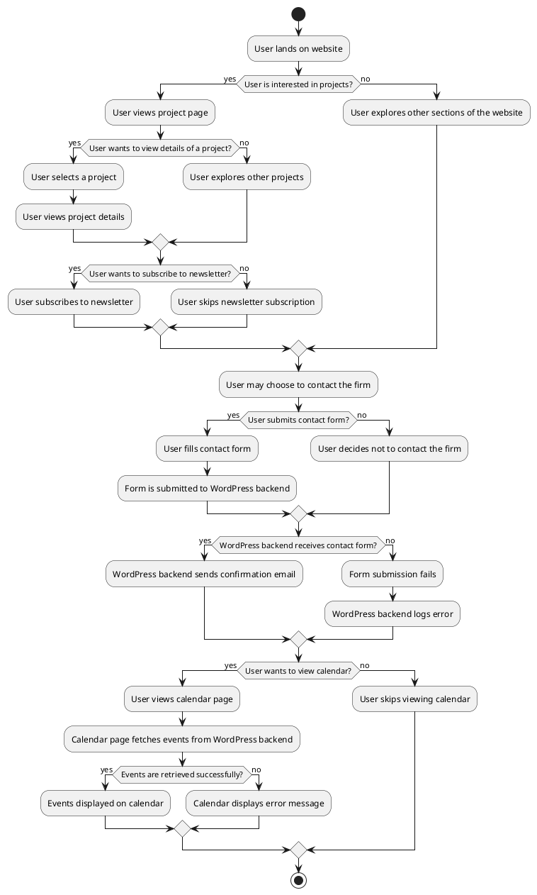
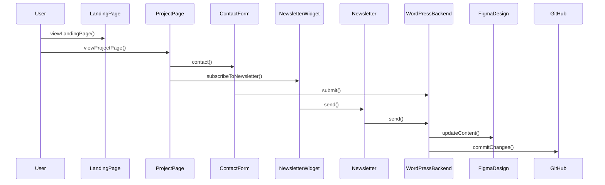
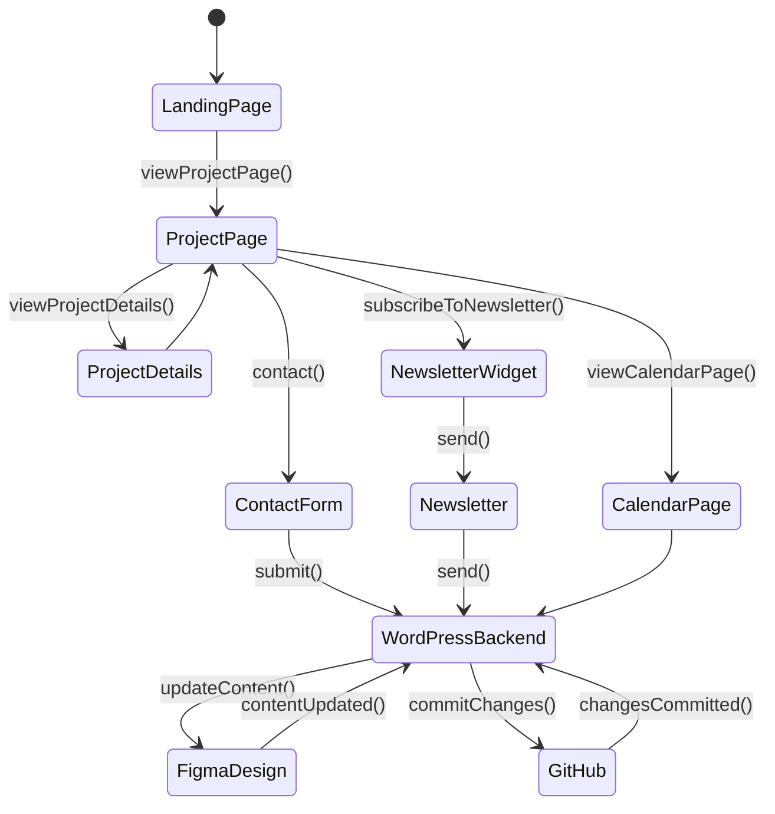

## Activity Diagram 

``` plantuml
@startuml
start
:User lands on website;
if (User is interested in projects?) then (yes)
    :User views project page;
    if (User wants to view details of a project?) then (yes)
        :User selects a project;
        :User views project details;
    else (no)
        :User explores other projects;
    endif
    if (User wants to subscribe to newsletter?) then (yes)
        :User subscribes to newsletter;
    else (no)
        :User skips newsletter subscription;
    endif
else (no)
    :User explores other sections of the website;
endif
:User may choose to contact the firm;
if (User submits contact form?) then (yes)
    :User fills contact form;
    :Form is submitted to WordPress backend;
else (no)
    :User decides not to contact the firm;
endif
if (WordPress backend receives contact form?) then (yes)
    :WordPress backend sends confirmation email;
else (no)
    :Form submission fails;
    :WordPress backend logs error;
endif
if (User wants to view calendar?) then (yes)
    :User views calendar page;
    :Calendar page fetches events from WordPress backend;
    if (Events are retrieved successfully?) then (yes)
        :Events displayed on calendar;
    else (no)
        :Calendar displays error message;
    endif
else (no)
    :User skips viewing calendar;
endif
stop
@enduml

```

## Interaction Diagram (Sequence Diagram):

``` mermaid
sequenceDiagram
    participant User
    participant LandingPage
    participant ProjectPage
    participant ContactForm
    participant NewsletterWidget
    participant Newsletter
    participant WordPressBackend
    participant FigmaDesign
    participant GitHub
    
    User->>LandingPage: viewLandingPage()
    User->>ProjectPage: viewProjectPage()
    ProjectPage->>ContactForm: contact()
    ProjectPage->>NewsletterWidget: subscribeToNewsletter()
    ContactForm->>WordPressBackend: submit()
    NewsletterWidget->>Newsletter: send()
    Newsletter->>WordPressBackend: send()
    WordPressBackend->>FigmaDesign: updateContent()
    WordPressBackend->>GitHub: commitChanges()

```

## State Chart Diagram:

```mermaid
stateDiagram
    [*] --> LandingPage
    LandingPage --> ProjectPage: viewProjectPage()
    ProjectPage --> ProjectDetails: viewProjectDetails()
    ProjectDetails --> ProjectPage
    ProjectPage --> ContactForm: contact()
    ProjectPage --> NewsletterWidget: subscribeToNewsletter()
    NewsletterWidget --> Newsletter: send()
    ContactForm --> WordPressBackend: submit()
    Newsletter --> WordPressBackend: send()
    WordPressBackend --> FigmaDesign: updateContent()
    WordPressBackend --> GitHub: commitChanges()
    ProjectPage --> CalendarPage: viewCalendarPage()
    CalendarPage --> WordPressBackend
    FigmaDesign --> WordPressBackend: contentUpdated()
    GitHub --> WordPressBackend: changesCommitted()

```