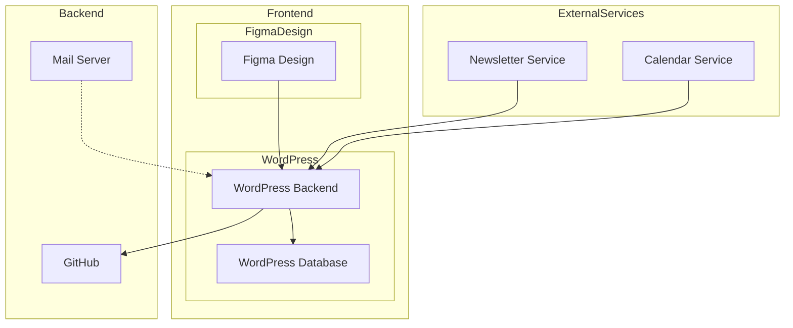

```mermaid
graph TD
    subgraph Frontend
        subgraph FigmaDesign
            A1[Figma Design]
        end
        subgraph WordPress
            A2[WordPress Backend]
            A3[WordPress Database]
        end
    end
    subgraph Backend
        A4[GitHub]
        A5[Mail Server]
    end
    subgraph ExternalServices
        A6[Newsletter Service]
        A7[Calendar Service]
    end
    A1 --> A2
    A2 --> A3
    A2 --> A4
    A5 -.-> A2
    A6 --> A2
    A7 --> A2
```
